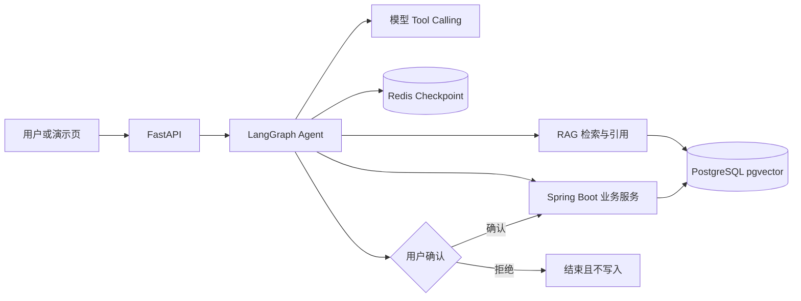

# OpsPilot

[](https://github.com/xypw/opspilot-agent-platform/actions/workflows/agent-evaluation.yml)
[](https://github.com/xypw/opspilot-agent-platform/releases/tag/v1.0.0)

OpsPilot 是一个面向电商售后的知识检索与业务执行 Agent。它把政策文档问答、订单查询、退货资格判断、用户确认和正式申请串成一条可恢复、可审计的流程。

Python 服务负责模型调用、RAG、工具编排和 Agent 状态；Java Spring Boot 服务负责权威业务校验、事务和数据库写入。模型不能直接修改业务数据，也不能绕过用户确认。

## 业务问题

- 售后政策分散在 PDF 中，人工查找慢且难以核对来源。
- 模型可以理解意图，但不应直接决定资格、金额或执行正式写入。
- 用户确认期间订单状态可能变化，旧确认不能继续使用。
- 服务重启、重复确认和并发请求不能造成状态丢失或重复申请。

## 架构



更完整的职责划分和请求链路见 [架构说明](docs/architecture.md)。

## 核心能力

### RAG 与证据引用

- 解析 PDF、按页切块并保留文档与页码元数据。
- 内存模式支持关键词/语义召回、RRF 融合和可替换 Reranker；pgvector 提供持久语义检索。
- 在相似度过滤后增加主题、答案类型、业务标识符和限定词检查，证据不足时不生成确定性结论。
- 引用由程序根据检索片段生成，回答可追溯到文档和页码。

### 工具调用与业务边界

- 使用 Pydantic 定义工具参数，拒绝缺失字段、非法编号和额外参数。
- Agent 通过 HTTP 调用 Java 订单及退货服务；资格、金额、状态和写入权限由 Java 校验。
- 只读工具可以直接执行，创建申请等副作用工具必须经过确定性确认门禁。

### 人工确认与一致性

- LangGraph `interrupt/resume` 暂停高风险操作，Redis 保存检查点并按 `thread_id` 恢复。
- 确认绑定订单、商品、金额、操作和有效期快照；权威状态变化后旧确认失效。
- Java 在事务中重新校验草稿，结合行锁、唯一约束和 `draft_id` 幂等键，重复确认返回同一申请。

### 失败处理与评测

- 区分未找到、业务冲突、确认过期、上游数据异常和服务失败。
- 保存工具轨迹、业务终态、引用和逐例失败原因，支持固定案例回归。
- GitHub Actions 运行 Python、演示页和 Java Maven 测试。

## 快速启动

要求 Docker Desktop 或兼容的 Docker Compose 环境。

```powershell
Copy-Item .env.example .env
docker compose up --build -d
docker compose ps
```

服务健康后访问：

- FastAPI 文档：<http://127.0.0.1:8011/docs>
- 演示页面：<http://127.0.0.1:8011/demo>
- Java 订单接口：<http://127.0.0.1:8081/api/orders/O-2001>

默认 Compose 不注入模型 API Key，适合使用虚构数据进行 mock、数据库、Redis 和 Java 跨服务联调。真实模型模式必须通过部署环境单独注入密钥，禁止提交 `.env`。

## 本地测试

```powershell
$env:REDIS_URL=' '
$env:TICKET_REPOSITORY_BACKEND='memory'
$env:ORDER_QUERY_BACKEND='memory'
.\.venv\Scripts\python.exe -X utf8 -m unittest discover -s tests
node --test static/demo.test.cjs
```

Java 服务测试：

```powershell
Set-Location business-service
mvn -B -ntp test
```

## 可复现证据

| 验证对象 | 当前结果 | 证据与边界 |
| --- | ---: | --- |
| Python 回归 | 382 通过，3 跳过 | 隔离内存配置；测试数不等于业务效果 |
| 演示页测试 | 3/3 | 检查确认按钮、任务恢复与确认快照 |
| 四服务模拟任务 | 7/7 | 验证跨服务控制流；不代表真实模型质量 |
| 确认前业务写入违规 | 0 | Java 权威副作用探针，覆盖固定 7 条任务 |
| 证据门禁固定回归 | 旧规则误放行 21/47；当前误放行 0、误拒 0 | 案例参与规则开发，不是独立未见集 |
| 真实模型固定任务 | 4/7 | 2 条供应商 429，1 条安全拒绝但漏调只读工具 |
| Reranker 对照 | Recall@3、MRR@3 均未测出增益 | 11 条正例过于简单，不支持提升结论 |

原始报告和简历表述对应关系见 [证据索引](docs/resume-evidence.md)。任何指标调整前都应重跑对应脚本并保留逐例报告，不能把 mock、规则基线或单元测试通过率改写成真实模型准确率。

## 演示与文档

- [三分钟演示脚本](docs/demo-script.md)
- [架构说明](docs/architecture.md)
- [简历证据索引](docs/resume-evidence.md)
- [跨服务集成记录](reports/2026-09-13-integration.md)
- [开发与教学历史](docs/development-notes.md)

## 当前边界

- 这是使用虚构数据的可复现个人项目，不宣称生产用户、线上流量或商业收益。
- PostgreSQL 路径当前提供持久语义检索；内存路径的关键词/RRF/重排能力尚未全部迁移到 PostgreSQL。
- 证据门禁是面向固定售后场景的确定性约束，不是通用语义蕴含模型。
- 自动清理过期草稿、集中式可观测性、公网鉴权部署和更大规模真实模型评测属于后续生产化工作。
