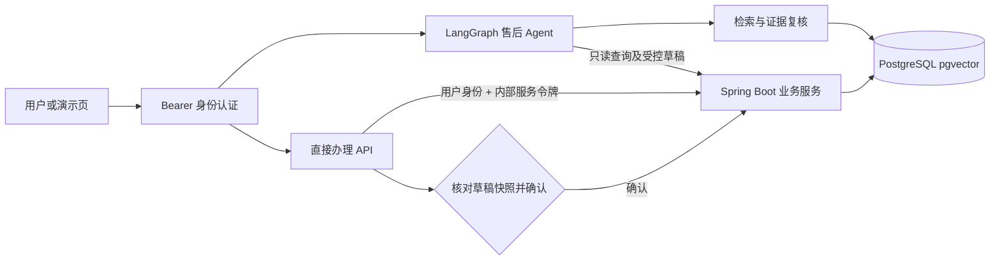

# OpsPilot

最近一次本机发布验收见 [2026-09-24 部署报告](reports/deployment-20260924.md)：应用更新、身份隔离、确认与幂等、真实 Redis 共享配额及窗口恢复均通过；本轮没有外部模型请求。

[](https://github.com/xypw/opspilot-agent-platform/actions/workflows/agent-evaluation.yml)
[](https://github.com/xypw/opspilot-agent-platform/releases/tag/v1.0.0)

OpsPilot 是一个面向电商售后的 **订单感知 Agent + RAG + Java 业务服务**。用户可以在对话中同时询问订单事实和售后政策；Agent 按需调用订单查询与知识检索，再用已验证的结果回答。固定的订单查询和申请办理也提供直达页面与 API。

Python 服务负责 PDF 入库、检索、证据复核、引用及受控业务 API；Java Spring Boot 服务负责权威订单规则、事务和数据库写入。模型不能决定退货资格，也不能绕过用户确认。

## 业务问题

- 售后政策分散在 PDF 中，人工查找慢且难以核对来源。
- 用户的售后问题可能同时需要当前订单事实和 PDF 政策证据；回答必须区分通用政策与这笔订单的实际状态。
- 政策问答必须能核对原文和页码；固定的订单与申请操作可由用户直接选择。
- 用户确认期间订单状态可能变化，旧确认不能继续使用。
- 服务重启、重复确认和并发请求不能造成状态丢失或重复申请。

## 架构


```mermaid
flowchart LR
    U[用户或演示页] --> AUTH[Bearer 身份认证]
    AUTH --> AGENT[LangGraph 售后 Agent]
    AUTH --> API[直接办理 API]
    AGENT --> RAG[检索与证据复核]
    RAG --> PG[(PostgreSQL pgvector)]
    AGENT -->|只读查询及受控草稿| JAVA[Spring Boot 业务服务]
    API -->|用户身份 + 内部服务令牌| JAVA[Spring Boot 业务服务]
    JAVA --> PG
    API --> HITL{核对草稿快照并确认}
    HITL -- 确认 --> JAVA
```

更完整的职责划分和请求链路见 [架构说明](docs/architecture.md)。
双服务的成本、Redis 检查点与共享限流、政策冲突及评测口径见 [架构取舍与验证边界](docs/architecture-decisions.md)。

## 核心能力

### Agent 的实际任务

- 当问题同时包含订单编号和政策、流程或时效，Agent 逐步选择订单查询与知识检索；每轮至多执行一个受控工具，工具步数最多 3 次。用户可在 `/demo` 查看工具轨迹。
- 联合问题只有同时取得有效订单结果和经门禁筛选的政策片段才算完成。模型提前给结论时提醒其补足缺失的只读工具一次；仍未补足则拒答。
- 最终联合回答由程序使用已校验的订单字段、政策原文与页码组装。通用退款时效不会被说成该订单已有确定到账日期。
- 问“这笔订单能否退货”只查询 Java 资格；明确要求办理时才创建草稿并等待人工确认。申请写入仍由 Java 判定。简单查询或用户已明确选择的办理步骤也可使用 `/service` 直达接口。

### RAG 与证据引用

- 解析 PDF、按页切块并保留文档与页码元数据。
- 内存模式支持关键词/语义召回、RRF 融合和可替换 Reranker；pgvector 提供持久语义检索。
- 相似度过滤后按业务主题、答案类型、业务编号和等级执行统一三态门禁。支持“款项返还、电子信箱、有权退货”等业务表达；未知主题或要求返回不确定，不默认放行。按语句及主语切换限定事实范围，避免把物流时效或保修条件用于退款和退货。
- 规则冲突直接拒绝；真实模式将规则接纳和不确定的候选一起交给语义审查器。具体判定和评测口径见 [证据准入设计](docs/evidence-policy.md)。
- 语义审查器只能选择候选片段中的逐字引文；格式错误、伪造引文或上游失败都会停止回答，不能绕过证据约束。
- 引用由程序根据检索片段生成，回答可追溯到文档和页码。

### 显式 API 与业务边界

- 使用 Pydantic 定义工具参数，拒绝缺失字段、非法编号和额外参数。
- 部署模式使用 Bearer Token 认证用户，并按用户隔离 LangGraph Checkpoint；知识库上传额外要求 knowledge_admin 角色。
- Python 调 Java 时同时转发用户身份和仅服务端持有的内部令牌；浏览器、模型、用户消息和 PDF 都拿不到该令牌，不能绕过编排层直接调用业务写接口。
- `/service/knowledge/answer` 返回政策原文与页码；规则模式无模型调用，真实复核模式只允许模型挑选可验证的逐字引文。
- `/service/orders/{order_id}`、资格与草稿接口直接调用 Java；Java 重新认证调用链、校验订单归属、资格、金额和状态。
- 确认接口要求提交页面展示的商品、金额和有效期快照；Java 在事务中再次校验。
- 用户消息、PDF 和工具输出一律作为不可信数据；其中的“忽略规则”或“直接改数据库”等内容不会改变工具白名单、权限或确认状态。

### 人工确认与一致性

- 显式业务接口的草稿状态由 Java 持久化。Agent 使用 LangGraph `interrupt/resume` 和 Redis 检查点恢复待确认任务。
- 确认绑定订单、商品、金额、操作和有效期快照；权威状态变化后旧确认失效。
- Java 在事务中重新校验草稿，结合行锁、唯一约束和 `draft_id` 幂等键，重复确认返回同一申请。

### 失败处理与评测

- Redis Lua 统一控制多实例的模型请求配额，普通调用、证据审查和重试共用限额；超额阻断，Redis 故障不回退单机计数。已验证跨进程共享与过期恢复，详细条件见 [架构取舍](docs/architecture-decisions.md)。限流不是供应商 429 的消除保证。
- 区分未找到、业务冲突、确认过期、上游数据异常和服务失败。
- Agent 保存工具轨迹；知识检索、证据与 Java 业务结果可分别检查。
- GitHub Actions 运行 Python、演示页和 Java Maven 测试。

## 快速启动

要求 Docker Desktop 或兼容的 Docker Compose 环境。

```powershell
Copy-Item .env.example .env
# 在 .env 中替换 OPSPILOT_AUTH_TOKENS 与 OPSPILOT_INTERNAL_SERVICE_TOKEN 的占位值
docker compose up --build -d
docker compose ps
```

服务健康后访问：

- FastAPI 文档：<http://127.0.0.1:8011/docs>
- 售后 Agent：<http://127.0.0.1:8011/demo>
- 直接办理页面：<http://127.0.0.1:8011/service>
- Java 订单接口只接受 Python 服务携带的双重凭据，不作为浏览器公开入口。

默认 Compose 不注入模型 API Key，适合使用虚构数据进行 mock、数据库、Redis 和 Java 跨服务联调。Compose 会强制启用身份认证；演示页只把用户访问令牌保存在当前标签页的 sessionStorage。真实模型模式必须通过部署环境单独注入密钥，禁止提交 `.env`。

## 本地测试

```powershell
$env:REDIS_URL=' '
$env:TICKET_REPOSITORY_BACKEND='memory'
$env:ORDER_QUERY_BACKEND='memory'
$env:OPSPILOT_AUTH_REQUIRED='false'
.\.venv\Scripts\python.exe -X utf8 -m unittest discover -s tests
node --test static/demo.test.cjs static/service.test.cjs
```

Java 服务测试：

```powershell
Set-Location business-service
mvn -B -ntp test
```

本机 Python→Java 冒烟：先在一个终端从 `business-service` 目录以 `OPSPILOT_AUTH_REQUIRED=false`、`RETURN_DRAFT_STORE_BACKEND=memory` 启动 `mvn spring-boot:run`；再从项目根目录运行 `.\.venv\Scripts\python.exe -X utf8 scripts\smoke_service_java.py`。只使用虚构订单，完成后停止 Java 服务。

独立证据集的纯规则基线（离线，不调用模型）：

```powershell
.\.venv\Scripts\python.exe -X utf8 scripts\evaluate_evidence_holdout.py --mode rules
```

真实语义审查会把 20 条虚构问题和候选片段发送给当前配置的模型服务，必须显式确认外发后再运行：

```powershell
.\.venv\Scripts\python.exe -X utf8 scripts\evaluate_evidence_holdout.py --mode live-review --allow-external-model
```

已有同名报告时使用 `--output reports/<新文件名>.json`，避免覆盖历史证据。每条结果同步写入 JSONL；单条模型错误不丢弃其他案例。失败关闭的拒答与有效语义判定分开统计。返回非零退出码表示存在误判或运行错误，详见报告。

## 可复现证据

| 验证对象 | 当前结果 | 证据与边界 |
| --- | ---: | --- |
| Python 回归（2026-09-23 证据修复后） | 共 430 项，427 通过，3 跳过 | 隔离内存配置；含 99 条固定证据子用例、显式 API 和联合回答门槛；测试数不等于业务效果 |
| 页面测试 | 4/4 | 旧演示页 3 项；新服务页确认快照交互 1 项 |
| Java 业务服务测试（2026-09-23） | 共 34 项，32 通过，2 跳过 | Maven 离线测试；未启动跨服务容器联调 |
| 本机 Python→Java 冒烟（2026-09-23） | 订单与资格查询、草稿读取、错误快照 409、正确确认提交通过 | Java 内存后端，关闭本地测试鉴权；不代表容器部署或生产链路 |
| 四服务模拟任务 | 7/7 | 验证跨服务控制流；不代表真实模型质量 |
| Agent 固定任务在证据修复后回归 | 8/8 | 资格咨询只读与明确申请分流；固定模拟模型，不代表真实模型成功率；见 `reports/agent-v3-verified.json` |
| 新证据审查单例真实模型冒烟 | 0 条有效语义结果 | 1 条虚构改写案例请求，供应商连续 3 次 HTTP 429；失败关闭，报告 `reports/evidence-live-smoke-20260923.json` |
| 确认前业务写入违规 | 0 | Java 权威副作用探针，覆盖固定 7 条任务 |
| 证据门禁固定回归 | 旧规则误放行 21/47；当前误放行 0、误拒 0 | 案例参与规则开发，不是独立未见集 |
| 旧 20 例诊断集修复前后 | 误拒 7→0，误放行 1→0 | 已用于本次修复，现为回归集；见 `reports/evidence-v3-diagnostic20-verified.json`，不得再称未见集 |
| 新增 32 例边界回归 | 误拒 5→0，误放行 6→0 | 实现修改前固定的成对正反例；同一开发任务编制，不代表独立线上准确率；见 `reports/evidence-v3-boundary32-verified.json` |
| 同一改写集真实语义审查（2026-09-19） | 充分证据接纳 7/10；有效判定且正确 15/20 | 1 条语义误拒、2 条格式错误、2 条 429；无错误放行包含失败关闭，不等于语义判断全部正确 |
| 真实模型固定任务 | 4/7 | 2 条供应商 429，1 条安全拒绝但漏调只读工具 |
| Reranker 对照 | Recall@3、MRR@3 均未测出增益 | 11 条正例过于简单，不支持提升结论 |

原始报告和简历表述对应关系见 [证据索引](docs/resume-evidence.md)，本轮修复对照见 [证据准入修复报告](reports/2026-09-23-evidence-v3.md)。任何指标调整前都应重跑对应脚本并保留逐例报告，不能把 mock、规则基线或单元测试通过率改写成真实模型准确率。

旧 Agent 评测数字来自改造前，不能当作新 `/service` 入口的业务成功率。新入口已完成 API、页面、Java 单独回归及本机跨服务冒烟；本轮真实模型单例因 429 无有效结果，仍无新 Agent 联合回答的真实模型成功率或容器部署效果数据。跨服务冒烟脚本为 `scripts/smoke_service_java.py`，需先启动 Java 内存服务并仅用于本地测试。

## 演示与文档

- [三分钟演示脚本](docs/demo-script.md)
- [架构说明](docs/architecture.md)
- [简历证据索引](docs/resume-evidence.md)
- [跨服务集成记录](reports/2026-09-13-integration.md)
- [证据审查真实评测与失败分析](reports/2026-09-19-evidence-review.md)

## 当前边界

- 这是使用虚构数据的可复现个人项目，不宣称生产用户、线上流量或商业收益。
- PostgreSQL 路径当前提供持久语义检索；内存路径的关键词/RRF/重排能力尚未全部迁移到 PostgreSQL。
- 三态规则只负责便宜且可解释的前置分流；真实模式的语义审查仍受模型质量、限流和测试集规模影响，不能视为通用事实正确性保证。
- 当前使用配置型演示 Token，不包含注册登录、令牌轮换或企业 OAuth/OIDC；自动清理过期草稿、集中式可观测性和更大规模真实模型评测仍属于后续生产化工作。
