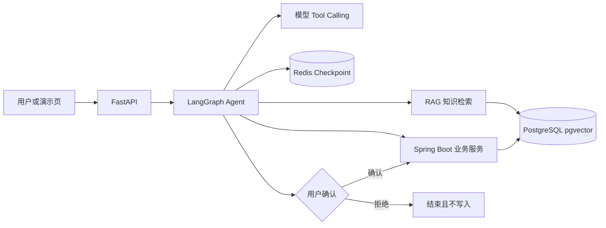

# OpsPilot 架构说明

## 业务链路

Python 侧负责非确定性的意图理解、工具选择、知识检索和流程编排；Java 侧负责退货资格、金额、订单状态、草稿有效期、事务写入与幂等。模型不能直接访问数据库，也不能绕过用户确认调用正式写入。

## 一次退货申请

1. Agent 查询订单并向 Java 服务发起退货草稿预审。
2. Java 返回资格、金额、商品、草稿编号与有效期，LangGraph 保存待确认状态。
3. API 把同一份快照展示给用户；拒绝时结束且不写正式申请。
4. 用户确认后，Java 在事务内锁定草稿并重新校验订单状态、金额和有效期。
5. `draft_id` 是幂等边界；重复确认读取并返回第一次成功创建的申请。
6. 如果快照过期或权威状态变化，返回冲突并要求产生新草稿，不能沿用旧确认。

## 知识问答链路

1. PDF 解析后按页保留来源元数据并切块。
2. 内存模式支持关键词与语义召回、RRF 融合和可选 Reranker；pgvector 模式提供持久语义检索。
3. 最低相似度先过滤低相关候选，再按主题、答案类型、业务标识符和限定词执行确定性证据门禁。
4. 只有通过门禁的片段进入回答上下文，引用由程序根据文档和页码生成。

## 关键取舍

- 没有为展示技术名词引入多 Agent；单 Agent 加确定性业务服务更容易测试和恢复。
- Redis 检查点负责流程恢复，Java 数据库负责业务写入，两者职责不同，不能用 Agent 状态代替业务事实。
- Reranker 是可替换优化项；当前 11 条简单正例没有测出增益，因此不宣称“重排提升准确率”。
