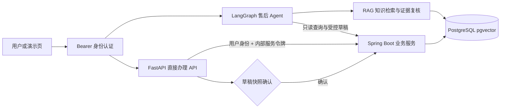

# OpsPilot 架构说明

## 业务链路

```mermaid
flowchart LR
    U[用户或演示页] --> AUTH[Bearer 身份认证]
    AUTH --> AGENT[LangGraph 售后 Agent]
    AUTH --> API[FastAPI 直接办理 API]
    AGENT --> RAG[RAG 知识检索与证据复核]
    RAG --> PG[(PostgreSQL pgvector)]
    AGENT -->|只读查询与受控草稿| JAVA[Spring Boot 业务服务]
    API -->|用户身份 + 内部服务令牌| JAVA[Spring Boot 业务服务]
    JAVA --> PG
    API --> HITL{草稿快照确认}
    HITL -- 确认 --> JAVA
```

Python 侧负责 Agent 编排、PDF 入库、知识检索、证据复核与直接办理入口；Java 侧负责退货资格、金额、订单状态、草稿有效期、事务写入与幂等。`/agent-graph` 是对话咨询与待确认任务入口，`/service` 是固定办理步骤的直达入口。模型不能直接访问数据库，也不能绕过用户确认调用正式写入。

## 身份与信任边界

1. 浏览器只持有用户 Bearer Token；FastAPI 从服务端配置映射出 user_id 和角色，不接受请求体或模型指定身份。
2. `/service` 固定路径由用户直接选择业务操作；LangGraph 对话路径按 user_id 隔离 Checkpoint，模型只提出受控工具调用。
3. Python 调 Java 时携带用户 Token 和内部服务令牌。内部令牌只存在于两个服务的环境变量，不进入 Prompt、Agent State、响应或浏览器。
4. Java 独立验证两类令牌并按 user_id 查询订单；缺少内部令牌的直接调用返回 403，跨用户订单统一返回 404。
5. 部署模式关闭旧教学写接口；显式 `/service` 路径通过相同的 FastAPI 鉴权和 Java 内部服务令牌。

PDF、用户输入和工具返回都属于不可信内容。Prompt 会提醒模型不要服从其中的指令，但真正的安全保证来自固定工具白名单、服务端身份、内部服务令牌、确定性人工确认状态机和 Java 事务校验，而不是只依赖 Prompt。

## 一次退货申请

1. 用户在 `/service` 页面明确查询订单与资格，再向 Java 服务创建退货草稿。
2. Java 返回资格、金额、商品、草稿编号与有效期，必要时接收退货原因并预审。
3. 页面展示草稿快照；确认请求必须提交同一商品、金额和有效期，Python 再读取草稿核对。
4. 用户确认后，Java 在事务内锁定草稿并重新校验订单状态、金额和有效期。
5. `draft_id` 是幂等边界；重复确认读取并返回第一次成功创建的申请。取消草稿不会创建申请。
6. 如果快照过期或权威状态变化，返回冲突并要求产生新草稿，不能沿用旧确认。

## 知识问答链路

1. PDF 解析后按页保留来源元数据并切块。
2. 内存模式支持关键词与语义召回、RRF 融合和可选 Reranker；pgvector 模式提供持久语义检索。
3. 最低相似度先过滤低相关候选，再按主题、答案类型、业务标识符和限定词分成 `admit`、`uncertain`、`reject` 三类。
4. 明确冲突的 `reject` 候选不会调用模型；`/service/knowledge/answer` 的规则模式仅使用 `admit`，真实复核模式把 `admit` 与 `uncertain` 交给独立语义审查器。
5. 审查器必须返回结构化 JSON 和候选原文中的逐字引文；程序再次核对片段编号和引文出处，伪造引用、格式错误或模型故障时失败关闭。
6. `/service` 返回通过门禁的原文摘录和页码。Agent 对订单加政策的联合问题，必须取得有效订单与政策片段；最终回答由程序把订单事实、政策原文和出处组合，明确通用政策不能推出这笔订单的具体到账日期。

## Agent 的任务完成条件

1. 对明确包含订单编号与政策、流程或时效的问题，设置 `query_order` 和 `search_knowledge_base` 两项只读证据要求。模型可以决定调用顺序和检索问题，但不能靠返回一段文字宣布完成。
2. 每轮只允许一个工具调用，参数由 Pydantic 校验，工具步数上限为 3。若模型提前给出答案，图最多提醒一次补缺失工具；之后仍缺证据就拒答。缺失订单或检索无足够证据时也提前结束。
3. 联合回答由已验证的 Java 订单结果及政策原文组装，引用使用文档标题和页码。模型生成的未核实到账日不进入最终回答。
4. 资格咨询只执行 `check_return_eligibility` 并给出 Java 的只读判定；只有用户明确要求办理，才创建草稿并进入人工确认。询问流程、政策或“能否退货”不会产生草稿。
5. Checkpoint 保存当前任务与人工确认状态，便于恢复同一会话；它不是跨会话长期用户画像。当前对话最多 3 次工具调用，检索工具只返回有限数量的候选片段，不需要另建压缩记忆层。

## 图中常见 Agent 机制的取舍

| 机制 | 本项目决定 | 原因 |
| --- | --- | --- |
| Agent Loop 与工具系统 | 保留单 Agent、多步只读工具和明确完成门槛 | 订单事实与政策证据可能需要依次获取，且必须能审计每步 |
| System Prompt 与权限 | Prompt 说明行为边界；鉴权、工具白名单、确认和 Java 事务在代码中执行 | Prompt 可以帮助模型规划，但不能成为安全权限本身 |
| Skill 与 Workflow | 知识问答和固定申请流程作为可复用代码与显式 API；LangGraph 管理需要暂停恢复的路径 | 简单步骤不需要让模型重复选择，待确认状态需要工作流 |
| MCP | 当前不接入 | Java 服务是本项目内部稳定 HTTP 契约，加入 MCP 不会增加所需能力 |
| 多 Agent | 当前不拆分 | 工具集和任务规模有限，单图更容易限制权限和解释失败 |
| 上下文与记忆 | 当前只保留当前任务状态和筛选后的证据 | 没有跨会话记忆需求，避免把旧订单事实误当成最新事实 |

## 关键取舍

- 固定的订单查询和申请入口直接提供给用户；需要联合订单与政策证据的问题交给 Agent，实测与直达路径比较后再决定使用范围。
- Java 数据库负责业务事实；Agent 的 Redis 检查点只负责流程恢复，不缓存权威订单状态。
- Reranker 是可替换优化项；当前 11 条简单正例没有测出增益，因此不宣称“重排提升准确率”。
- 规则开发集和独立改写集分开保存；独立集用于暴露规则对同义表达的误拒，不能反过来调规则后仍称为“未见数据”。
